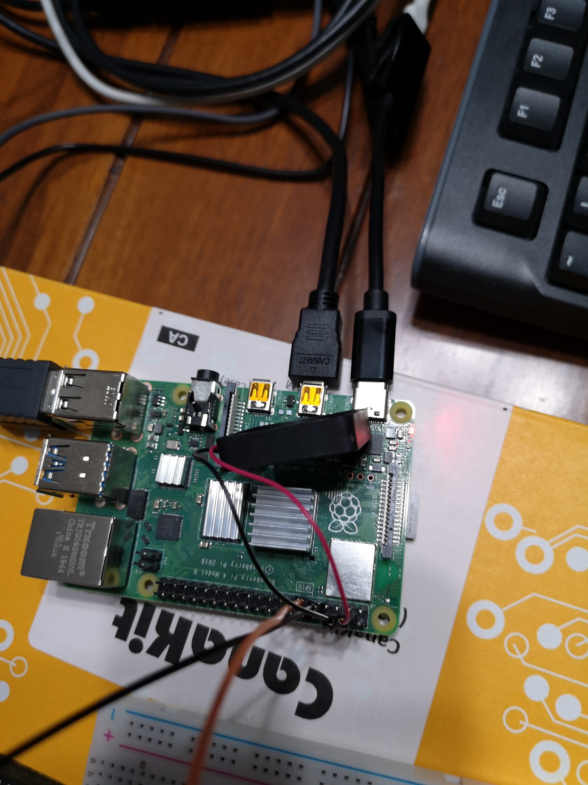
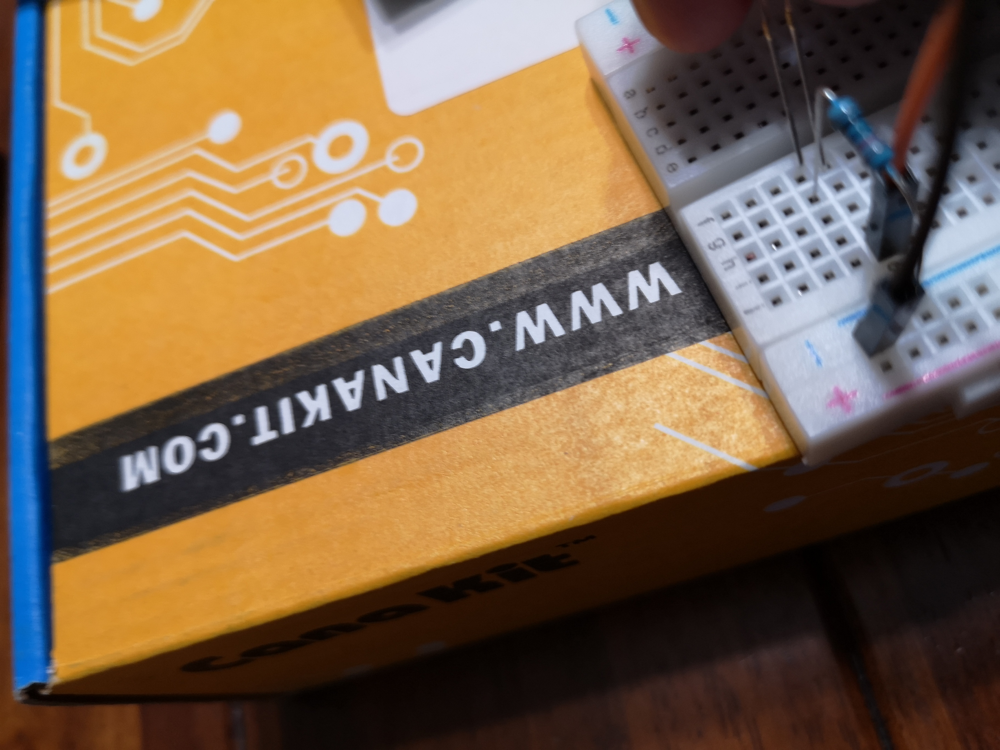
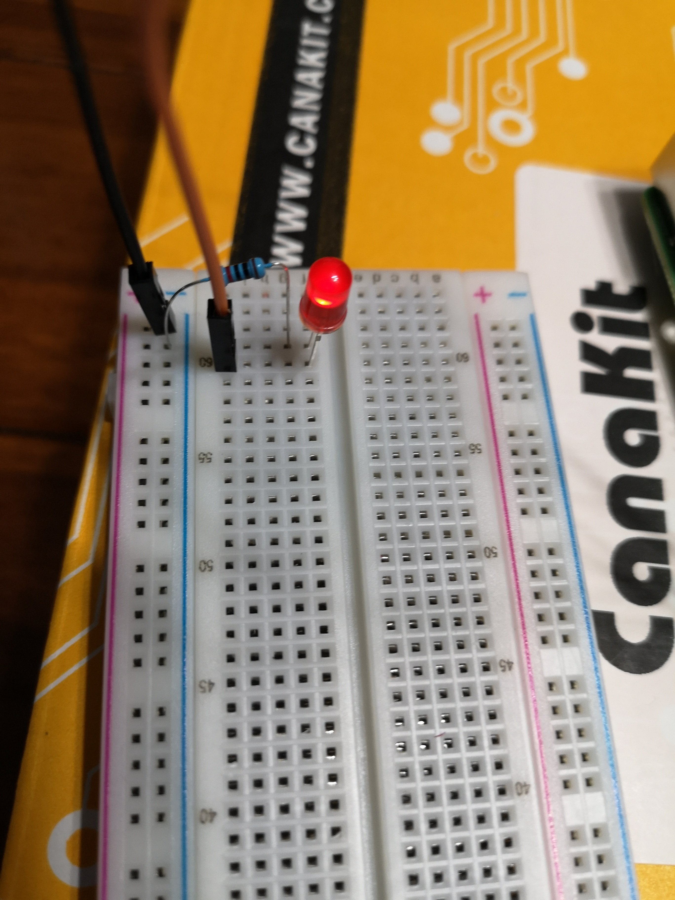
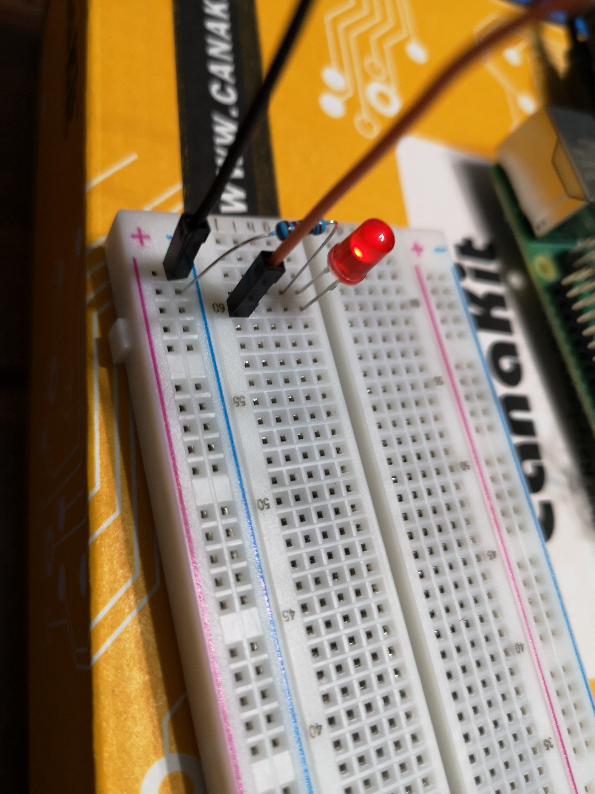

# Flasher une LED avec un Raspberry Pi 4 en Python

Ce référentiel est la solution du [tutoriel de thepihut](https://thepihut.com/blogs/raspberry-pi-tutorials/tutorial-flashing-led-using-gpio-output).

## Composantes

Pour l'exercice, il faut avoir en main les composantes suivantes :

- une LED
- un _resistor_
- un _breadboard_

## Précautions

Pour prévenir les potentiels problèmes, faites attention à l'orientation de la _breadboard_.

De plus, sachez que la patte la plus longue correspond à l'anode (positif) et la patte la plus courte la cathode (négatif).

Pour terminer, il est nécessaire d'être en mesure de différencier [le mode BCM versus le mode BOARD](https://raspberrypi.stackexchange.com/questions/12966/what-is-the-difference-between-board-and-bcm-for-gpio-pin-numbering).

## Illustrations

Voici quelques illustrations pour faciliter l'interprétation du diagramme :

_Dans le cadre du cours 420-253-MT Objets connectés_

Tous droits réservés 2021 © Alexis Garon-Michaud
